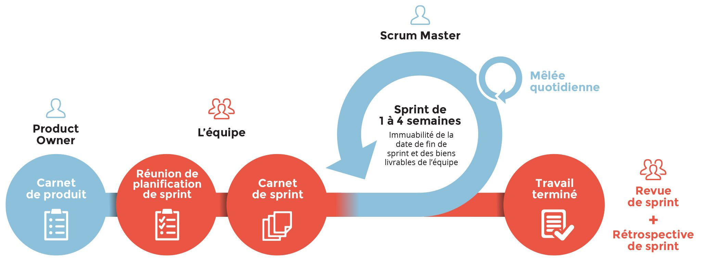

# CDA_Journal

## Journal de formation Concepteur d'Application (2022)

## Table des matières

1. [Les principes de la méthodes agile](##Les principes de la méthode agile) 

### Semaine du 10/10

---

## Les principes de la méthode agile

- Satisfaire le client avec un produit de qualité et de nécessité
- Accueillir  favorablement les demandes de changements
- Mise à jour fonctionnelle fréquente
- Collaboration quotidienne dev et client
- Satisfaire les demandes des collaborateurs et créer un lien de confiance 
- Communication face à face
- Priorisé la continuité face à la nouveauté
- Faire avancé le projet avec un rythme constant
- Rigueur technique et conception avancée qui renforce l’agilité
- Minimiser le superflu pour se concentrer sur l’essentiel
- Auto-responsabilité des membres de l’équipe
- Adaptation des comportement et du travail dans l’équipe régulièrement après debrief

---

### Satifaire

> Présenter des demos fonctionnel.  
> Définir correctement les besoins client, satisfaire pendant une démo technique.  

### Adaptation

> Se réadapter au nouveau besoin du client.  
> Anticiper de potentielle changement même tardif dans le processus.  
> Le changement et le bienvenue.  

### Productivité

> Fournir fréquement des solutions fonctionnelles.  
> Prioriser les solutions importantes.  
> Segmenter la productions du projet.  
> Une ligne de conduite rigoureuse lors du développement du projet.  
> Productivité constante.  
> La simplicité et l'art de maximisé la quantité de travail que on ne fait pas.  

### Communication client

> Le client fait partie de l'équipe.  
> Communication permanante avec le client.  
> Etablir une relation de confiance avec le client.  

### Communication 

> Adaptation et amélioration de l'équipe  
> Privilégier le contacte humain.  
> &nbsp;&nbsp;&nbsp;&nbsp;Ex : L'envoie de mail ne retranscrit pas les sentiments réel d'une personne, le contacte humain facilite la compréhension. 
> Le contacte humain facilite la compréhension.  
> Communication verbal et non verbal (communication face à face).  
> Auto-responsabilisé les membres de l'équipe.

### Motivation

> Encourager les personnes de l'équipe.  
> Entraide.  
> Créer un lieux de travail adequat.  
> Créer une relation de confiance avec son équipe.  

### Organisation

> Membres auto-organisé.  
> Choix des technologies par rapport au besoin du client.  

## Le scrum

### Définition

> Le scrum est une methode de travail simple permettant d'aborder des problématiques complexes, et les livrées de manière efficace.

